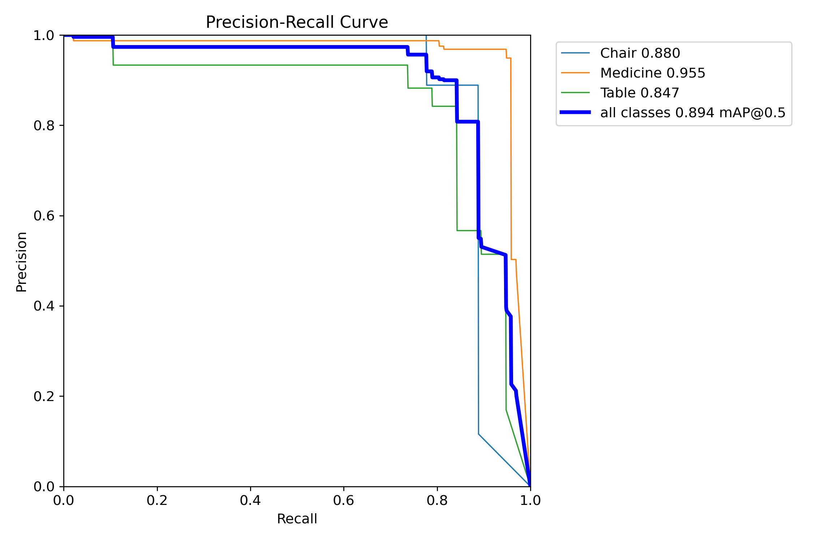
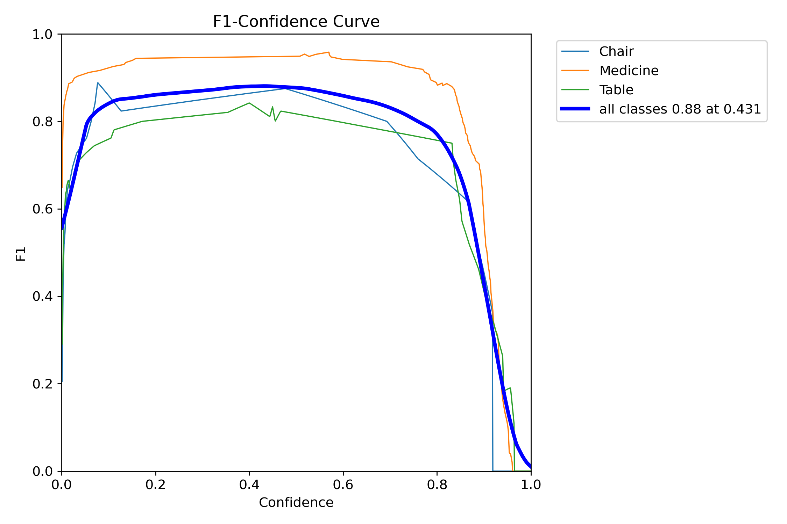
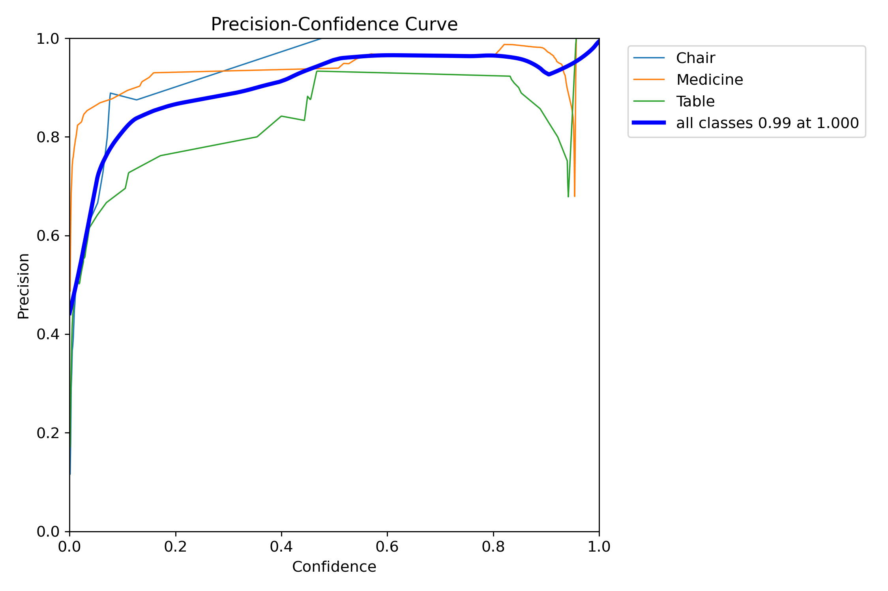
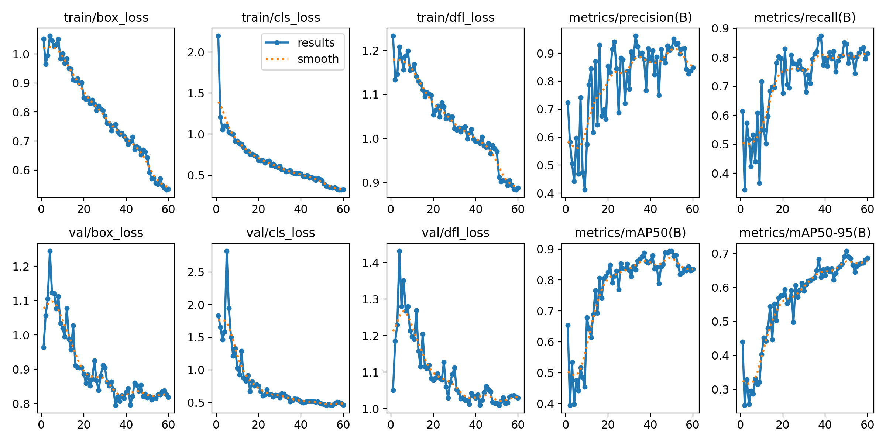
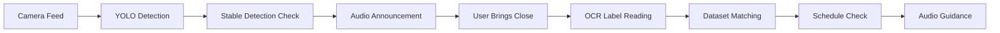

# Medicine Detection Assistant

A Python application that detects medicines in real-time using YOLOv8 and provides audio feedback with spatial guidance, helping visually impaired users locate and identify medicines around them.
This project combines object detection, text-to-speech, and stable detection logic to ensure accurate and reliable announcements.

## Overview

This project combines computer vision, OCR, and text-to-speech technology to create an accessible medicine management system. Using YOLOv8 for real-time detection, the application helps users locate their medicines, verifies them through label reading, and provides personalized schedule-based guidance.

## Key Features

- **Real-Time Detection** - Identifies medicines via webcam using custom-trained YOLOv8 model
- **Audio Feedback** - Announces detected medicines with spatial positioning (left/center/right)
- **Stable Detection** - Reduces false positives by requiring objects to remain visible for 1 second
- **Personalized Schedules** - Manages individual medicine routines with dosage and timing information
- **OCR Verification** - Confirms medicine identity by reading labels when brought close to camera
- **Smart Guidance** - Suggests appropriate medicines based on current time and user schedule
- **Accessibility First** - Designed specifically for visually impaired users

## Custom Dataset

The YOLOv8 model was trained on a custom dataset collected by us, designed specifically for real-life use by visually impaired users.

### Dataset Characteristics

- ~420 total images
- Images captured in real environments:
  - Medicines on tables, cupboards, beds, and floors
  - Medicines held in hand (different angles and distances)
  - Top-view and side-view variations
- Diverse lighting conditions and backgrounds

### Why Custom Data?

Generic datasets are not sufficient for this use case.  
The dataset was intentionally designed to teach the model:

- Context awareness (medicine on surface vs in hand)
- Realistic placement scenarios
- Robust detection in cluttered environments

---

## Model Training

- Architecture: **YOLOv8**
- Input Resolution: **640×640**
- Training Type: **Single-class and multi-class detection**
- Training Type: **Supervised object detection**
- Data Augmentation: Not used
  The model was trained purely on real captured images without synthetic augmentation.
  This ensures that detections reflect real-world conditions encountered by visually impaired users, at the cost of requiring careful data collection.

---

## Model Performance

### Overall Performance Metrics of Model version 2.0

| Metric    | Value |
| --------- | ----- |
| Precision | 0.919 |
| Recall    | 0.846 |
| mAP@50    | 0.893 |
| mAP@50–95 | 0.700 |

These results indicate:

- **High precision**, reducing false detections
- Strong recall for consistent detection
- Reliable generalization across varied environments

---

## Training & Evaluation Curves For Model Version 2.0:

The following curves were analyzed to evaluate model performance:

### Precision–Recall Curve



### F1 Score Curve



### Precision Curve



### Recall Curve


### Training Summary



---

## CLI Method To Run the model

```bash
python my_model/yolo_detect.py --model my_model_v2/my_model_v2.pt --source 0 --thresh 0.5 --resolution 640x480
```

## How It Works



1. **Detection** - YOLOv8 identifies medicines in real-time
2. **Stability Check** - Confirms object presence for 1 second.
3. **Position Announcement** - Provides spatial audio feedback
4. **Verification** - Uses OCR to read medicine labels
5. **Matching** - Cross-references with user's medicine database
6. **Guidance** - Suggests appropriate medicine based on schedule

---

## Technical Architecture


---

## OCR

### Advanced OCR Pipeline

A 5-layer preprocessing pipeline ensures robust label recognition:

1. **Grayscale Conversion:** Converts cropped regions of interest to grayscale for uniform processing.
2. **Adaptive Thresholding:** Enhances contrast for variable lighting conditions.
3. **Otsu Denoising:** Removes noise and small artifacts for clearer text extraction.
4. **Contrast Enhancement:** Improves readability of low-contrast labels.
5. **Inverted Image OCR:** Handles reversed or colored text on labels.

- **Fallbacks:** If one preprocessing layer fails to produce readable text, the system automatically selects the best result from other layers.

---

## Use Cases

- Daily medication management for visually impaired individuals
- Medication verification before consumption
- Schedule adherence assistance
- Independent living support
- Caregiver support tool

## Future Roadmap

- [ ] Mobile app deployment (iOS/Android)
- [ ] Voice command integration
- [ ] Cloud-based dataset synchronization
- [ ] Pill reminder notifications
- [ ] Emergency contact alerts
- [ ] Handwritten prescription OCR
- [ ] Multi-language support

## License

This project is licensed under the MIT License - see the [LICENSE](LICENSE) file for details.

## Disclaimer

This application is designed to assist with medication management but **should not replace professional medical advice**. Always consult healthcare providers regarding medication usage and management.
